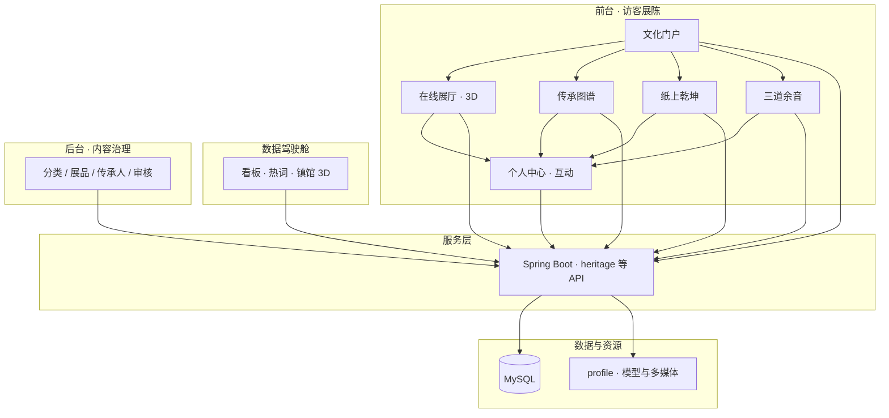
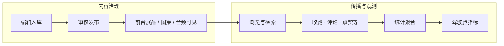
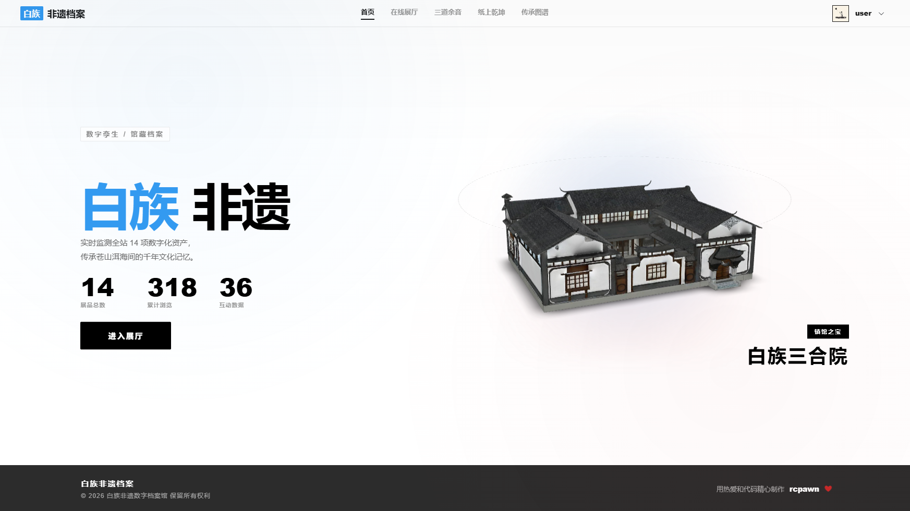
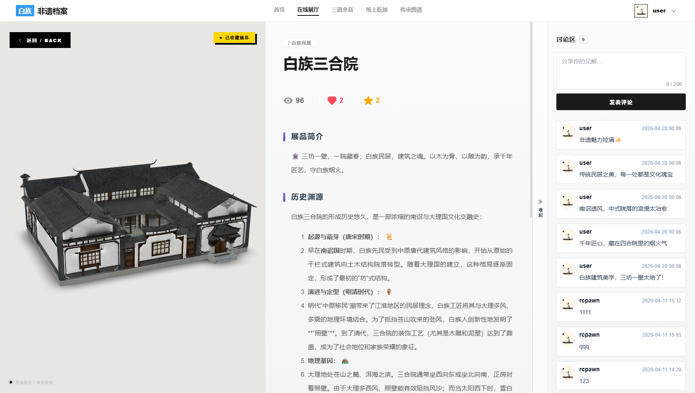
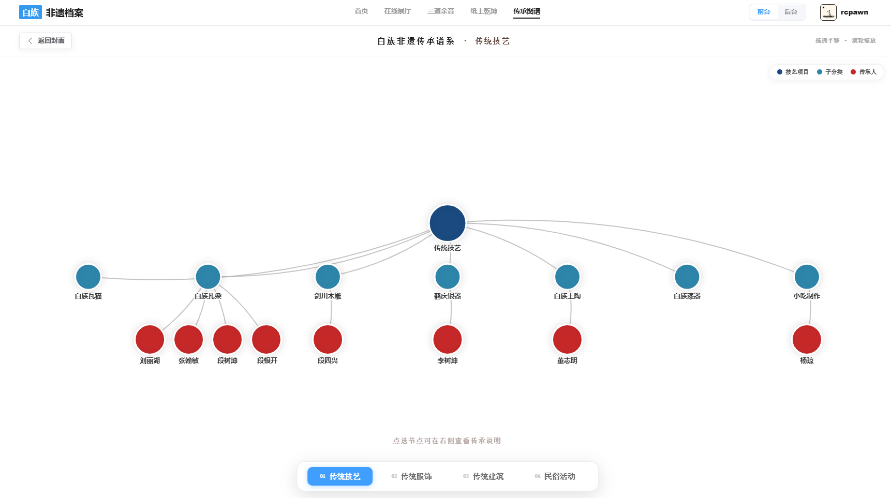
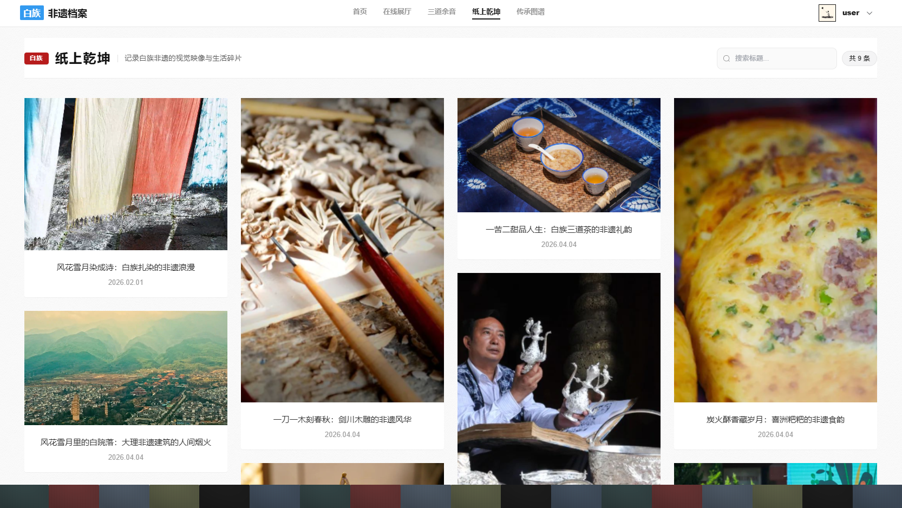
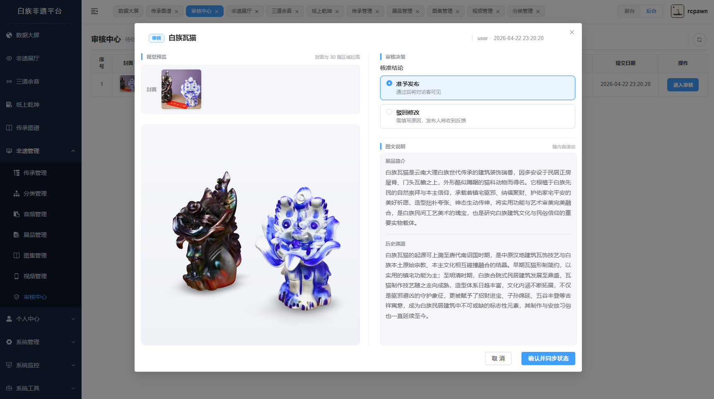
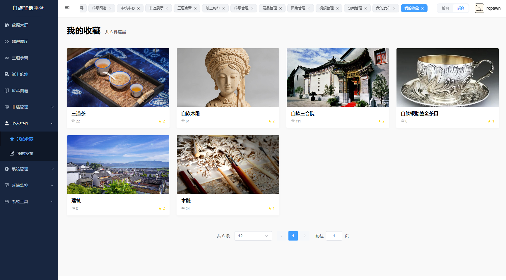

# 非遗虚拟展陈与数据监测平台

> 面向白族非遗资源的 **Web 展陈、3D 互动与数据看板** 一体化系统，支持内容治理、用户行为与传播效果的可视化分析。

<div align="center">

[](https://vuejs.org/)
[](https://spring.io/projects/spring-boot)
[](https://modelviewer.dev/)
[](https://echarts.apache.org/)
[](LICENSE)

</div>

---

## 项目简介

**白族非遗数字博物馆** 将 **3D 展示、在线展陈、数据驾驶舱** 与 **后台内容管理** 结合，以大理白族文化（如扎染、木雕、建筑、服饰等）为业务载体，在 Web 端完成资源数字化呈现、传播与运营。

**能力概览：**

- **3D 与展陈**：基于 Web 的模型浏览、分类检索与详情阅读，支撑公开参观与教学演示。
- **活态传承**：以图谱与档案形式组织传承人、技艺与关联资源。
- **数据与质量**：看板统计、接口压测与内容审核、分类与展品维护，便于上线前性能与内容双把关。

---

## 功能架构

不从「功能清单」罗列价值：下面两张 **Mermaid** 图分别表达 **系统分层与调用关系**、**内容治理与用户行为的闭环**。在 GitHub / Gitee 等支持 Mermaid 的平台上可直接渲染；若本地预览不显示图，可将本节复制到 [Mermaid Live Editor](https://mermaid.live) 查看。

### 分层与模块关系

自上而下：**访客前台**由门户串联多条内容线，汇总至个人互动；**驾驶舱**与**后台**共用同一套业务服务；服务层统一访问 **MySQL** 与 **profile** 静态资源（模型、图、音、视频）。



### 内容流与行为闭环

左侧强调 **可运营链路**：元数据与多媒体经后台进入前台；右侧强调 **可观测链路**：浏览、收藏、评论等行为经服务层聚合，再回到驾驶舱（与本仓库中对大屏接口做压测的场景一致——聚合读路径往往是容量敏感点）。



**阅读提示：** 第一张图回答「系统由哪些块组成、请求落到哪里」；第二张图回答「内容怎么上架、数据怎么回到大屏」。下文「界面与能力说明」中的截图按访客动线展开，可与第一张图中的前台子域一一对应。

---

## 界面与能力说明

以下编排参考常见开源项目 README 的做法：**访客最关心的「数据大屏 + 前台动线」单独成块、大图居中**，便于一眼看清产品形态；**后台与运营类界面**仍用双栏压缩篇幅，需要部署或二次开发时再细看即可。

### 📊 数字驾驶舱 · 一屏总览

面向运营与公众演示场景，将 **藏品规模、分类结构、访问与互动趋势、热词云、最新入库** 等关键指标放在同一视图中；一侧保留 **3D 镇馆** 区域，适合展厅大屏或投影快速建立认知。

<p align="center">
  
</p>

<p align="center"><em>适合展会、汇报与教学演示：先在一屏内建立全局印象，再引导进入各业务模块。</em></p>

### 🧪 大屏接口压测 · 上线前佐证

驾驶舱依赖多条 **聚合统计接口**，在集中演示或短时高并发下容易被放大。示例使用 **JMeter** 对大屏相关接口进行压测，从 **吞吐量、平均响应、错误率** 等维度记录结果，便于与连接池、缓存、SQL 优化等措施对照，在上线前发现瓶颈。

<p align="center">
  
</p>

<p align="center"><em>便于在技术文档或答辩材料中对照吞吐、延迟与错误率，与优化措施一并呈现。</em></p>

### 🏠 文化门户首页

入口页负责 **信息分层与浏览动线**：从品牌区到功能入口，风格上与整体 **黑白极简** 一致，降低首次访问的认知负担，引导用户进入展厅、专题与音频、图集等板块。

<p align="center">
  
</p>

<p align="center"><em>首页承担「从认识到行动」的引导：品牌 — 功能入口 — 深入展厅。</em></p>

### 🎪 在线展厅 · 列表与检索

前台列表支持 **分类筛选、关键词搜索与卡片化浏览**，便于从大量非遗条目中快速定位兴趣点；布局兼顾笔记本与常规桌面宽度。

<p align="center">
  
</p>

### 🔍 展品详情 · 3D 与互动

详情页集成 **Google Model Viewer**，支持 **360° 旋转、缩放与光照**；展示 **浏览量、点赞、收藏、评论** 等互动数据，标题与标签采用渐变与圆角等细节，强化「单件展品」的阅读焦点。

<p align="center">
  
</p>

<p align="center"><em>单件展品的「深度阅读」界面：模型交互与社交数据同屏呈现。</em></p>

### 📜 传承图谱 · 3D 翻书入口

以 **3D 翻书** 作为叙事载体，点击后进入传承主线：相比平铺列表，更易在文化类站点中形成记忆点。

<p align="center">
  
</p>

### 🌳 传承关系网络

展开后以 **力导向图** 呈现传承人、技艺分类、师承关系及级别标识；节点与连线帮助理解「人与技艺」的拓扑，悬停或侧栏可查看档案摘要。

<p align="center">
  
</p>

### 📸 纸上乾坤 · 瀑布流图集

影像档案采用 **CSS 多列瀑布流**，卡片高度随内容伸缩，适合摄影作品与非统一竖横比的素材混排。

<p align="center">
  
</p>

### 🖼️ 纸上乾坤 · 沉浸大图

从瀑布流进入 **单图沉浸阅读**，突出画面主体与说明文案；可与排序规则、拍摄信息等元数据组合使用。

<p align="center">
  
</p>

### 🎵 三道余音 · 声音档案

音频页整合 **播放控制与波形可视化**，并与 **解说 / 唱词** 等内容同步展示，可与展品或 3D 资源形成视听一体的参观路径。

<p align="center">
  
</p>

### 🛠️ 后台与内容运营（双栏一览）

面向管理员与内容编辑：**分类维护、展品录入、审核流转** 与用户侧 **我的收藏** 等能力衔接，形成「录入 → 审核 → 发布 → 反馈」闭环。此处采用 **双栏拼图**，节省纵向篇幅；若你主要关心前台体验，可跳过本节。

| 🗂️ 分类管理 | 📦 展品管理 |
|:--:|:--:|
|  |  |

| ✅ 审核中心 | ⭐ 我的收藏（管理侧） |
|:--:|:--:|
|  |  |

---

## 技术栈

### 前端

| 技术 | 版本 | 说明 |
|------|------|------|
| Vue.js | 3.x | 渐进式前端框架 |
| Vite | 4.x | 构建工具 |
| Element Plus | 2.x | Vue 3 组件库 |
| Three.js | r150+ | 三维渲染 |
| @google/model-viewer | latest | Web 端 glTF/GLB 查看 |
| ECharts | 5.x | 图表与可视化 |
| Axios | 1.x | HTTP 客户端 |
| SCSS | - | 样式预处理 |

### 后端

| 技术 | 版本 | 说明 |
|------|------|------|
| Spring Boot | 2.5.x | 应用框架 |
| MyBatis | 3.5.x | ORM |
| Druid | 1.2.x | 连接池 |
| JWT | 0.9.x | 认证 Token |
| MySQL | 8.0+ | 关系型数据库 |
| Redis | 6.x | 缓存（可选） |

### 开发工具

- **IDE**：IntelliJ IDEA / VS Code  
- **构建**：Maven / npm  
- **接口**：Postman / Apifox  
- **版本**：Git  

---

## 快速开始

### 环境要求

- Node.js >= 16.0  
- JDK >= 1.8  
- MySQL >= 8.0  
- Maven >= 3.6  

### 后端启动

```bash
# 1. 克隆项目
git clone https://github.com/your-username/RuoYi-Vue.git

# 2. 导入数据库
mysql -u root -p < sql/all_table.sql

# 3. 修改配置
# 编辑 ruoyi-admin/src/main/resources/application.yml，填写数据库等连接信息

# 4. 启动后端
cd RuoYi-Vue-master
mvn clean package
java -jar ruoyi-admin/target/ruoyi-admin.jar
```

### 前端启动

```bash
cd ruoyi-ui
npm install
npm run dev
# 浏览器访问 http://localhost:80
```

### 默认账号

- 管理员：`admin` / `admin123`  
- 普通用户：`user` / `admin123`  

---

## 项目结构（节选）

```
RuoYi-Vue-master/
├── ruoyi-admin/
│   └── src/main/java/com/ruoyi/heritage/   # 非遗业务
├── ruoyi-ui/
│   ├── src/views/display/                  # 前台展示
│   └── src/views/heritage/                 # 后台管理
├── sql/
├── profile/                                # 静态资源（模型、图音视频）
└── README.assets/                          # 文档配图（中文文件名）
```

---

## 设计与性能要点

1. **视觉**：界面以黑白灰为主、点缀渐变，呼应白族尚白审美，同时保证数据与控件可读性。  
2. **交互**：点赞、收藏、翻书转场、图集懒加载与平滑滚动等，控制在不干扰阅读的前提下增强反馈。  
3. **响应式**：兼顾笔记本常见分辨率与大屏；复杂页面可参考仓库内门户与图集详情页的响应式约定。  
4. **性能**：GLB 压缩、图片懒加载、数据库索引与可选 Redis；驾驶舱类接口建议配合压测与监控。  

---

## 数据库（核心表）

- `heritage_item` — 非遗展品  
- `heritage_category` — 分类  
- `heritage_inheritor` — 传承人  
- `heritage_gallery` / `heritage_gallery_image` — 图集  
- `heritage_audio` — 音频档案  
- `heritage_user_action` — 用户行为  

完整定义见 `sql/current_all_table.sql`。

---

## 贡献指南

1. Fork 本仓库  
2. 新建分支：`git checkout -b feature/YourFeature`  
3. 提交：`git commit -m '说明本次改动'`  
4. 推送并发起 Pull Request  

---

## 开源协议

本项目基于 [MIT License](LICENSE) 开源。

---

## 致谢

- [若依](http://www.ruoyi.vip/) — 后台脚手架  
- [Google Model Viewer](https://modelviewer.dev/) — Web 3D 模型展示  
- [ECharts](https://echarts.apache.org/) — 数据可视化  
- 云南网、中国非物质文化遗产网等公开资料  

---

## 联系方式

- Email: your-email@example.com  
- Issues: [GitHub Issues](https://github.com/your-username/RuoYi-Vue/issues)  

---

<div align="center">

若本项目对你有帮助，欢迎 Star。

Made with care by rcpawn

</div>
