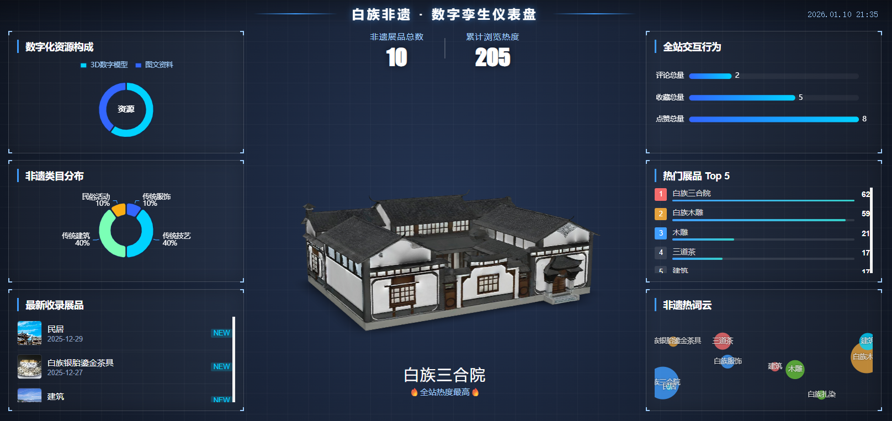
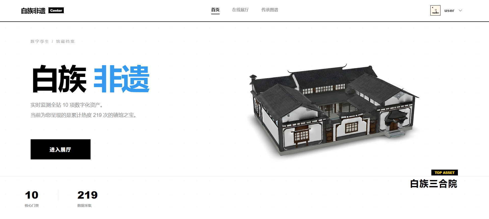
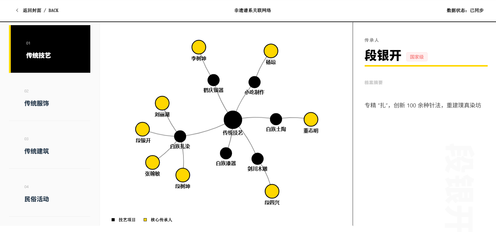

# 📦 非遗虚拟展陈与数据监测平台

## 📊 功能模块大观

```plaintext
📦 非遗虚拟展陈与数据监测平台
├─────────────────────────────────────────────────────────────────
│
├── 🌏 数字驾驶舱    <- [已完成] 3D核心 + ECharts数据可视化
│
├── 🎪 在线展厅      <- [已完成] 卡片列表 + 详情页
│
├── 📜 传承图谱 [🌟 亮点: 3D翻书]
│   └── 👴 系谱之书 (3D翻页交互，展示师徒传承脉络)
│
├── 🎨 云染工坊 [待实现]
│   ├── 🤖 AI扎染定制 (选择折法 -> 选色 -> AI生成纹样)
│   └── 👕 文创模拟室 (图片生成 3D 模型)
│
├── 📅 非遗视频、大师音频...[待实现]
│
├── 🏛️ 非遗管理 
│   ├── 📦 非遗分类      <- [已完成]
│   ├── 🏺 非遗展品      <- [已完成] 核心CRUD
│   ├── 👴 传承人管理    <- [已完成] 非遗的核心是“人”，记录大师信息
│   └── 🕵️ 审核中心      <- [已完成]
│
├── 👤 个人中心 
│   ├── ⚙️ 个人资料      <- [必做] 修改头像、昵称、密码
│   ├── ⭐ 我的收藏      <- [已完成]
│   ├── 📝 我的发布      <- [已完成] 用户上传自己拍的非遗照片(UGC)
│   └── 💬 我的评论      <- [推荐] 管理自己发出的评论
│
└── 🛠️ 系统管理 [若依自带]
    ├── 用户管理 / 角色管理 / 菜单管理
    └── 日志监控
```


## 🌏 数字驾驶舱

数字驾驶舱作为系统的**数据总览入口**，通过 **ECharts 数据可视化 + 3D 场景融合** 的方式，直观展示非遗资源的整体情况，包括：

- 非遗项目数量统计
- 分类分布情况
- 浏览热度与访问趋势
- 用户行为分析等关键指标



##  🏛️ 前台首页



## 📜 传承图谱

传承图谱是用于展示非遗技艺传承关系的可视化模块，主要功能包括：

- 以非遗技艺为中心的传承关系网络展示
- 传承人、技法分支等多类型节点的关联呈现
- 支持点击节点查看传承人或技艺的详细信息




## 🎪 在线展陈

在线展厅是面向普通用户的核心展示模块，主要功能包括：

- 非遗展品卡片式列表展示
- 展品分类筛选与关键词搜索
- 展品详情页展示（模型展示 + 图文介绍 + 相关信息）


